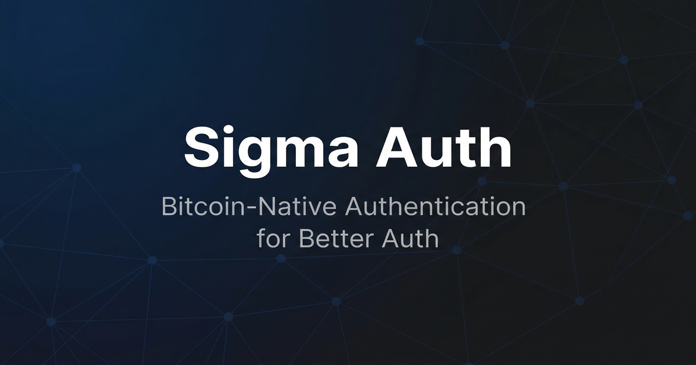

# @sigma-auth/better-auth-plugin



Bitcoin-native authentication for Better Auth. Users sign in with their Bitcoin wallet. Identity is a cryptographic keypair — persistent across apps, controlled only by the user.

Maintained by [Sigma Identity](https://sigmaidentity.com). For support, open an issue on [GitHub](https://github.com/b-open-io/better-auth-plugin/issues).

## Features

- **Passwordless from day one** — Bitcoin wallet signatures replace passwords and magic links
- **BAP identity support** — Bitcoin Attestation Protocol provides persistent, portable user profiles
- **PKCE OAuth flow** — Fully spec-compliant authorization code flow with PKCE for public clients
- **Iframe signer** — Client-side signing without exposing private keys to your app domain
- **Local signer fallback** — Optional local TokenPass server for offline or privacy-first deployments
- **NFT-based role gating** — Assign roles based on NFT collection ownership across connected wallets
- **Token balance gating** — Grant roles when users hold minimum BSV-21 token balances
- **BAP admin whitelist** — Designate admins by Bitcoin identity key, checked at every session creation
- **Multi-identity wallets** — Users can select among multiple BAP identities at sign-in
- **Subscription tiers** — Verified subscription status flows through to your session
- **Next.js App Router** — Ready-to-use route handlers with a single import
- **Payload CMS** — Drop-in callback handler with customizable user creation
- **Convex** — Works inside `@convex-dev/better-auth` with no local auth instance required
- **Full TypeScript** — All types exported, including `SigmaUserInfo`, `BAPProfile`, and JWT claims

## Installation

```bash
bun add @sigma-auth/better-auth-plugin
# or
npm install @sigma-auth/better-auth-plugin
```

### Peer dependencies

Install only what you use:

```bash
# Required for all integrations
bun add better-auth

# Required for server-side token exchange
bun add bitcoin-auth

# Required for the provider plugin (running your own auth server)
bun add @bsv/sdk bsv-bap @neondatabase/serverless zod

# Required for Payload CMS integration
bun add payload-auth
```

## Quick Start

This is the standard setup for an app that authenticates users via Sigma Identity. The whole flow takes under five minutes.

### 1. Set environment variables

```bash
# .env.local
NEXT_PUBLIC_SIGMA_CLIENT_ID=your-app-id
NEXT_PUBLIC_SIGMA_AUTH_URL=https://auth.sigmaidentity.com
SIGMA_MEMBER_PRIVATE_KEY=your-wif-private-key   # server-side only
```

Get your client ID and register your redirect URI at [sigmaidentity.com/developers](https://sigmaidentity.com/developers).

### 2. Configure the auth client

```typescript
// lib/auth.ts
import { createAuthClient } from "better-auth/client";
import { sigmaClient } from "@sigma-auth/better-auth-plugin/client";

export const authClient = createAuthClient({
  baseURL: process.env.NEXT_PUBLIC_SIGMA_AUTH_URL || "https://auth.sigmaidentity.com",
  plugins: [sigmaClient()],
});
```

### 3. Add the token exchange route

```typescript
// app/api/auth/sigma/callback/route.ts
import { createCallbackHandler } from "@sigma-auth/better-auth-plugin/next";

export const runtime = "nodejs";
export const POST = createCallbackHandler();
```

### 4. Add the OAuth callback page

```typescript
// app/auth/sigma/callback/page.tsx
"use client";

import { Suspense, useEffect } from "react";
import { useRouter, useSearchParams } from "next/navigation";
import { authClient } from "@/lib/auth";

function CallbackContent() {
  const router = useRouter();
  const searchParams = useSearchParams();

  useEffect(() => {
    authClient.sigma.handleCallback(searchParams)
      .then((result) => {
        // Store tokens and user data in your state management solution
        localStorage.setItem("sigma_user", JSON.stringify(result.user));
        localStorage.setItem("sigma_access_token", result.access_token);
        router.push("/");
      })
      .catch((err) => {
        authClient.sigma.redirectToError(err);
      });
  }, [searchParams, router]);

  return <p>Completing sign in...</p>;
}

export default function CallbackPage() {
  return (
    <Suspense fallback={<p>Loading...</p>}>
      <CallbackContent />
    </Suspense>
  );
}
```

### 5. Add a sign-in button

```typescript
import { authClient } from "@/lib/auth";

export function SignInButton() {
  return (
    <button
      onClick={() =>
        authClient.signIn.sigma({
          clientId: process.env.NEXT_PUBLIC_SIGMA_CLIENT_ID!,
        })
      }
    >
      Sign in with Bitcoin
    </button>
  );
}
```

The user clicks the button, authenticates with their Bitcoin wallet on the Sigma Identity server, and lands back in your app with a `SigmaUserInfo` object containing their pubkey, display name, and BAP identity.

---

## Architecture

### How Bitcoin authentication works

Bitcoin auth relies on a cryptographic signature the user produces with a private key that remains in their wallet — the signature is request-specific, timestamped, and covers the request body, so replaying it against a different endpoint or a modified payload fails verification.

The flow:

1. Your app redirects to `auth.sigmaidentity.com/oauth2/authorize` with a PKCE challenge
2. Sigma's wallet gate checks whether the user has an accessible Bitcoin identity (local backup, cloud backup, or creates one)
3. The user signs a challenge with their Bitcoin private key
4. Sigma's Better Auth server validates the signature and issues an authorization code
5. Your backend exchanges the code for tokens using a Bitcoin-signed request (`X-Auth-Token` header)
6. You receive an OIDC `id_token`, an `access_token`, and the user's `SigmaUserInfo` including their `pubkey` and BAP identity

The user's identity is their Bitcoin key — stored in their wallet, verifiable cryptographically, and independent of your app's database.

### Signer architecture

The plugin supports two signing backends. Both implement the same `SigmaSigner` interface.

**Iframe signer (default)** — A hidden iframe loads `auth.sigmaidentity.com/signer`. Your app communicates with it via `postMessage`. Private keys stay on the Sigma domain and are never accessible to your JavaScript context. The iframe surfaces a password prompt when the wallet is locked.

**Local signer** — An optional [TokenPass](https://tokenpas.app) desktop application running at `http://localhost:21000`. When `preferLocal: true` is set, the client probes for the local server first and falls back to the iframe if unavailable. This enables fully offline signing.

```typescript
// Prefer local signer with iframe fallback
const authClient = createAuthClient({
  plugins: [
    sigmaClient({
      preferLocal: true,
      localServerUrl: "http://localhost:21000",
      onServerDetected: (url, isLocal) => {
        console.log(`Using ${isLocal ? "local" : "cloud"} signer: ${url}`);
      },
    }),
  ],
});
```

### Integration modes

| Mode | When to use | Session management |
|------|-------------|-------------------|
| **Mode A — OAuth client** | Your app is separate from the auth server (most apps) | Tokens in localStorage or your state management |
| **Mode B — Same-domain** | You run Better Auth on the same domain as your app | Session cookies + `useSession` hook |

---

## Server configuration (Mode B)

When you run Better Auth on the same domain as your app, use `sigmaCallbackPlugin` to handle the OAuth callback inside Better Auth itself. No separate API route is needed.

```typescript
// lib/auth.ts
import { betterAuth } from "better-auth";
import { sigmaCallbackPlugin } from "@sigma-auth/better-auth-plugin/server";

export const auth = betterAuth({
  plugins: [sigmaCallbackPlugin()],
});
```

```typescript
// app/api/auth/[...all]/route.ts
import { toNextJsHandler } from "better-auth/next-js";
import { auth } from "@/lib/auth";

export const { GET, POST } = toNextJsHandler(auth);
```

The client stays identical — `sigmaClient()` detects whether the auth server is on the same domain and routes the callback accordingly.

### Options

```typescript
sigmaCallbackPlugin({
  accountPrivateKey?: string;  // Default: SIGMA_MEMBER_PRIVATE_KEY env
  clientId?: string;           // Default: NEXT_PUBLIC_SIGMA_CLIENT_ID env
  issuerUrl?: string;          // Default: NEXT_PUBLIC_SIGMA_AUTH_URL env
  callbackPath?: string;       // Default: "/auth/sigma/callback"
  emailDomain?: string;        // Default: "sigma.local"
})
```

---

## Client API reference

All methods are available on the object returned by `createAuthClient({ plugins: [sigmaClient()] })`.

### Authentication

```typescript
// Redirect to Sigma Identity for sign-in
authClient.signIn.sigma({
  clientId: "your-app",
  callbackURL: "/auth/sigma/callback",    // default
  errorCallbackURL: "/auth/sigma/error",
  bapId: "specific-identity-id",          // for multi-identity wallets
  prompt: "select_account",               // force account selection
  forceLogin: false,                      // bypass existing session check
});

// Handle the OAuth redirect in your callback page
const result = await authClient.sigma.handleCallback(searchParams);
// result: { user: SigmaUserInfo, access_token, id_token, refresh_token? }

// Redirect to error page with structured error params
authClient.sigma.redirectToError(caughtError);
```

### Identity management

```typescript
// Get the current BAP identity (set automatically after handleCallback)
const bapId = authClient.sigma.getIdentity(); // string | null

// Manually set identity (for multi-identity scenarios)
authClient.sigma.setIdentity("bap-identity-id");

// Clear stored identity on logout
authClient.sigma.clearIdentity();

// Check whether signer is ready
const ready = authClient.sigma.isReady(); // boolean
```

### Signing

The signing keys remain on `auth.sigmaidentity.com` — only the resulting signature string is returned to your JavaScript context.

```typescript
// Sign an API request (returns X-Auth-Token string)
const authToken = await authClient.sigma.sign("/api/posts", { title: "Hello" });
fetch("/api/posts", {
  method: "POST",
  headers: { "X-Auth-Token": authToken },
  body: JSON.stringify({ title: "Hello" }),
});

// Sign OP_RETURN data for Bitcoin transactions (AIP format)
const signedOps = await authClient.sigma.signAIP(["6a", "..."]);

// Encrypt a message for a specific friend (Type42 key derivation)
const ciphertext = await authClient.sigma.encrypt(
  "Hello!",
  "friend-bap-id",
  friend.pubkey,         // optional
);

// Decrypt a message from a friend
const plaintext = await authClient.sigma.decrypt(
  ciphertext,
  "friend-bap-id",
  sender.pubkey,
);

// Get your derived public key for a friend (for friend requests)
const myPubKey = await authClient.sigma.getFriendPublicKey("friend-bap-id");
```

### Signer detection

```typescript
const { url, isLocal } = await authClient.sigma.detectServer();
const signerType = authClient.sigma.getSignerType(); // "local" | "iframe" | null
```

### Wallet management

```typescript
// Get connected wallets for the current user
const { wallets } = await authClient.wallet.getConnected();

// Connect an additional wallet
await authClient.wallet.connect(bapId, authToken, "yours");

// Disconnect a wallet
await authClient.wallet.disconnect(bapId, walletAddress);

// Set primary wallet (for receiving NFTs)
await authClient.wallet.setPrimary(bapId, walletAddress);
```

### NFT ownership

```typescript
// List all NFTs across connected wallets
const { wallets, totalNFTs } = await authClient.nft.list();

// Force refresh from blockchain
const fresh = await authClient.nft.list(true);

// Verify ownership of a collection or specific origin
const { owns, count } = await authClient.nft.verifyOwnership({
  collection: "collection-id",
  minCount: 1,
});
```

### Subscriptions

```typescript
// Get subscription status based on NFT ownership
const status = await authClient.subscription.getStatus();
// status: { tier: "free" | "plus" | "pro" | "premium" | "enterprise", isActive, features }

// Check if current tier meets a minimum requirement
const hasAccess = authClient.subscription.hasTier(status.tier, "pro");
```

---

## Database schema

The plugin extends your Better Auth schema. **Do not hand-write these tables** — run the CLI to generate them:

```bash
npx @better-auth/cli generate
```

This produces the complete Drizzle schema with all plugin fields. Run your migration tool (`drizzle-kit push`, etc.) after generating.

### `user` table additions

| Column | Type | Description |
|--------|------|-------------|
| `pubkey` | `string` (unique, optional) | Bitcoin public key. Written by `/sign-in/sigma` and consumer callbacks when available. |
| `bapId` | `string` (unique, optional) | BAP identity ID. Written by consumer callbacks from the OAuth response `bap_id` claim. |
| `subscriptionTier` | `string` | Subscription tier (`free`, `plus`, `pro`, `premium`, `enterprise`). Added when `enableSubscription: true` on the provider. |
| `roles` | `string` | Comma-separated role list. Added by `sigmaAdminPlugin`. |

### `session` table additions

| Column | Type | Description |
|--------|------|-------------|
| `subscriptionTier` | `string` | Mirrors subscription tier for fast session reads |
| `roles` | `string` | Mirrors roles for fast session reads |

### `oauthClient` table additions (provider only)

These fields are additive on top of the `oauth-provider` base table. Only needed if your app acts as an OAuth provider (identity server).

| Column | Type | Description |
|--------|------|-------------|
| `ownerBapId` | `string` (optional) | BAP ID of the client owner |
| `memberPubkey` | `string` (optional) | Public key used to verify `X-Auth-Token` on token exchange |

---

## Next.js integration

### Simple callback (tokens only)

Use `createCallbackHandler` when you manage authentication state yourself (Mode A).

```typescript
// app/api/auth/sigma/callback/route.ts
import { createCallbackHandler } from "@sigma-auth/better-auth-plugin/next";

export const runtime = "nodejs";
export const POST = createCallbackHandler({
  issuerUrl: process.env.NEXT_PUBLIC_SIGMA_AUTH_URL,
  clientId: process.env.NEXT_PUBLIC_SIGMA_CLIENT_ID,
  callbackPath: "/auth/sigma/callback",
});
```

### Better Auth callback (tokens + session cookie)

Use `createBetterAuthCallbackHandler` to get a session cookie set alongside the tokens. This integrates with your local Better Auth instance.

```typescript
// app/api/auth/sigma/callback/route.ts
import { createBetterAuthCallbackHandler } from "@sigma-auth/better-auth-plugin/next";
import { auth } from "@/lib/auth-server";

export const runtime = "nodejs";
export const POST = createBetterAuthCallbackHandler({ auth });
```

With a custom user creation handler:

```typescript
export const POST = createBetterAuthCallbackHandler({
  auth,
  createUser: async (adapter, sigmaUser) => {
    return adapter.create({
      model: "user",
      data: {
        email: sigmaUser.email,
        name: sigmaUser.name,
        emailVerified: true,
        bapId: sigmaUser.bap_id,
        role: "subscriber",
        createdAt: new Date(),
        updatedAt: new Date(),
      },
    });
  },
});
```

### Error page utility

```typescript
// app/auth/sigma/error/page.tsx
"use client";

import { parseErrorParams } from "@sigma-auth/better-auth-plugin/next";
import { useSearchParams } from "next/navigation";

export default function ErrorPage() {
  const searchParams = useSearchParams();
  const error = parseErrorParams(searchParams);

  return (
    <div>
      <h1>{error?.error ?? "Authentication failed"}</h1>
      <p>{error?.errorDescription}</p>
    </div>
  );
}
```

---

## Convex integration

For apps using `@convex-dev/better-auth`, use `sigmaCallbackPlugin` inside your Convex auth configuration. No separate callback route is needed — the plugin registers `POST /sigma/callback` inside Better Auth, and the existing catch-all proxy forwards it to Convex.

```typescript
// convex/betterAuth.ts
import { betterAuth } from "better-auth/minimal";
import { createClient, type GenericCtx } from "@convex-dev/better-auth";
import { convex } from "@convex-dev/better-auth/plugins";
import { sigmaCallbackPlugin } from "@sigma-auth/better-auth-plugin/server";
import { components } from "./_generated/api";
import type { DataModel } from "./_generated/dataModel";
import authConfig from "./auth.config";

export const authComponent = createClient<DataModel>(components.betterAuth);

export const createAuth = (ctx: GenericCtx<DataModel>) =>
  betterAuth({
    baseURL: process.env.SITE_URL,
    secret: process.env.BETTER_AUTH_SECRET,
    database: authComponent.adapter(ctx),
    plugins: [
      convex({ authConfig }),
      sigmaCallbackPlugin(),
    ],
  });
```

Set environment variables in your Convex deployment:

```bash
bunx convex env set SIGMA_MEMBER_PRIVATE_KEY "<your-wif-key>"
bunx convex env set NEXT_PUBLIC_SIGMA_CLIENT_ID "your-app-id"
```

Delete `app/api/auth/sigma/callback/route.ts` if you previously had one — the catch-all proxy handles it.

---

## Payload CMS integration

```typescript
// app/api/auth/sigma/callback/route.ts
import configPromise from "@payload-config";
import { createPayloadCallbackHandler } from "@sigma-auth/better-auth-plugin/payload";

export const runtime = "nodejs";
export const POST = createPayloadCallbackHandler({ configPromise });
```

With custom user creation:

```typescript
export const POST = createPayloadCallbackHandler({
  configPromise,
  createUser: async (payload, sigmaUser) => {
    return payload.create({
      collection: "users",
      data: {
        email: sigmaUser.email || `${sigmaUser.sub}@sigma.identity`,
        name: sigmaUser.name,
        emailVerified: true,
        bapId: sigmaUser.bap_id,
        role: ["subscriber"],
      },
    });
  },
});
```

### Payload callback options

```typescript
interface PayloadCallbackConfig {
  configPromise: Promise<unknown>;   // required
  issuerUrl?: string;                // Default: NEXT_PUBLIC_SIGMA_AUTH_URL
  clientId?: string;                 // Default: NEXT_PUBLIC_SIGMA_CLIENT_ID
  memberPrivateKey?: string;         // Default: SIGMA_MEMBER_PRIVATE_KEY
  callbackPath?: string;             // Default: "/auth/sigma/callback"
  usersCollection?: string;          // Default: "users"
  sessionsCollection?: string;       // Default: "sessions"
  sessionCookieName?: string;        // Default: "better-auth.session_token"
  sessionDuration?: number;          // Default: 30 days (ms)
  createUser?: (payload, sigmaUser) => Promise<{ id: string | number }>;
  findUser?: (payload, sigmaUser) => Promise<{ id: string | number } | null>;
}
```

---

## Admin plugin

`sigmaAdminPlugin` resolves roles dynamically at session creation based on on-chain state. It works alongside Better Auth's built-in `admin` plugin — static roles set via `admin.setRole()` are preserved alongside dynamic ones.

```typescript
import { betterAuth } from "better-auth";
import { admin } from "better-auth/plugins";
import { sigmaAdminPlugin } from "@sigma-auth/better-auth-plugin/server";

export const auth = betterAuth({
  plugins: [
    sigmaAdminPlugin({
      // Grant a role to holders of a specific NFT collection
      nftCollections: [
        { id: "abc123_0", role: "pixel-fox-holder" },
        { id: "def456_0", role: "premium" },
      ],

      // Grant a role based on minimum token balance
      tokenGates: [
        { ticker: "GM", threshold: 75000, role: "premium" },
        { ticker: "GM", threshold: 1000000, role: "whale" },
      ],

      // Grant admin role to specific BAP identities
      adminBAPIds: [process.env.SUPERADMIN_BAP_ID!],

      // Fetch connected wallets for NFT/token checking
      getWalletAddresses: async (userId) => {
        return db.query("SELECT address FROM wallets WHERE user_id = $1", [userId]);
      },

      // NFT ownership check (implement with your indexer)
      checkNFTOwnership: async (address, collectionId) => {
        const nfts = await fetchNftUtxos(address, collectionId);
        return nfts.length > 0;
      },

      // Token balance check (implement with your indexer)
      getTokenBalance: async (address, ticker) => {
        return fetchTokenBalance(address, ticker);
      },

      // BAP profile resolver
      getBAPProfile: async (userId) => {
        return db.profiles.findByUserId(userId);
      },

      // Custom role resolution logic
      extendRoles: async (user, bap, address) => {
        const roles: string[] = [];
        if (await isVerifiedCreator(bap?.idKey)) {
          roles.push("creator");
        }
        return roles;
      },
    }),

    admin({ defaultRole: "user" }),
  ],
});
```

Roles are attached to both `session.user.roles` and `user.roles` as a comma-separated string, updated on every session creation and session fetch.

---

## Provider plugin (running your own auth server)

If you are building a Sigma-compatible auth server (like `auth.sigmaidentity.com` itself), use `sigmaProvider` to add Bitcoin signature verification to the OIDC token endpoint and BAP identity support.

```typescript
import { betterAuth } from "better-auth";
import { sigmaProvider, createBapOrganization } from "@sigma-auth/better-auth-plugin/provider";

export const auth = betterAuth({
  plugins: [
    sigmaProvider({
      // Resolve Bitcoin pubkey to BAP identity
      resolveBAPId: async (pool, userId, pubkey, register) => {
        const result = await pool.query(
          "SELECT bap_id FROM profile WHERE member_pubkey = $1",
          [pubkey],
        );
        return result.rows[0]?.bap_id ?? null;
      },

      getPool: () => databasePool,

      cache: redisClient,

      enableSubscription: true,

      debug: process.env.NODE_ENV === "development",
    }),

    // BAP identities map to organizations (one org per identity)
    createBapOrganization(),
  ],
});
```

The provider plugin intercepts `POST /oauth2/token` to validate the Bitcoin-signed `X-Auth-Token` header — verifying the signature pubkey matches the `memberPubkey` registered for the OAuth client — and to update the user's name and avatar from their selected BAP profile once the token exchange succeeds.

---

## Type reference

### `SigmaUserInfo`

Returned by `handleCallback` and the `userinfo` endpoint.

```typescript
interface SigmaUserInfo {
  sub: string;              // User ID
  name?: string;
  given_name?: string;
  family_name?: string;
  picture?: string;
  email?: string;
  pubkey: string;           // Bitcoin public key
  bap_id?: string;          // BAP identity ID
  bap?: BAPProfile;         // Full BAP profile
}
```

### `BAPProfile`

```typescript
interface BAPProfile {
  idKey: string;            // BAP identity key
  rootAddress: string;      // Root Bitcoin address
  currentAddress?: string;
  identity?: {
    "@type"?: string;
    alternateName?: string; // Display name
    givenName?: string;
    familyName?: string;
    image?: string;
    banner?: string;
    description?: string;
  };
}
```

### `OAuthCallbackResult`

```typescript
interface OAuthCallbackResult {
  user: SigmaUserInfo;
  access_token: string;
  id_token: string;         // OIDC JWT
  refresh_token?: string;
}
```

### `SubscriptionStatus`

```typescript
interface SubscriptionStatus {
  tier: "free" | "plus" | "pro" | "premium" | "enterprise";
  isActive: boolean;
  nftOrigin?: string;
  walletAddress?: string;
  expiresAt?: Date;
  features?: string[];
}
```

---

## Troubleshooting

### 403 on token exchange

**Symptom:** OAuth completes, redirect comes back with `?code=...`, but then you get "Token Exchange Failed — Server returned 403."

**Cause:** Better Auth's CSRF protection rejects the POST because the requesting origin is not in `trustedOrigins`. This is common on Vercel preview deployments where URLs change per branch.

**Fix:** Add Vercel's automatic environment variables to `trustedOrigins`:

```typescript
export const auth = betterAuth({
  trustedOrigins: [
    "https://your-production-domain.com",
    process.env.VERCEL_URL ? `https://${process.env.VERCEL_URL}` : "",
    process.env.VERCEL_BRANCH_URL ? `https://${process.env.VERCEL_BRANCH_URL}` : "",
    "http://localhost:3000",
  ].filter(Boolean),
});
```

This is a Better Auth configuration requirement.

### Callback URL not registered

Register every domain you deploy to — including Vercel preview URLs — as an allowed redirect URI in your Sigma OAuth client settings.

### `SIGMA_MEMBER_PRIVATE_KEY` mismatch

The WIF key in your environment must correspond to the public key registered as `memberPubkey` on your OAuth client record. If they differ, the signature verification step will reject every token exchange with `invalid_client`.

To verify: derive the public key from your WIF using `@bsv/sdk`, then compare it to the `memberPubkey` in your database.

### `Missing id_token in token response`

Ensure `scope: "openid profile"` is included in the authorization request. The `openid` scope is required for OIDC `id_token` issuance.

### Local signer not detected

The local [TokenPass](https://tokenpas.app) server must be running at `http://localhost:21000` (or your configured `localServerUrl`) before the page loads. The probe runs once on initialization; if the server starts after the page loads, call `authClient.sigma.detectServer()` to retry.

---

## Claude Code plugin

An AI-assisted setup plugin is available for Claude Code:

```bash
claude plugin install sigma-auth@b-open-io
```

Available skills:

| Skill | Command | Description |
|-------|---------|-------------|
| setup-nextjs | `/sigma-auth:setup-nextjs` | Project detection, env validation, and health check |
| setup-convex | `/sigma-auth:setup-convex` | Convex + Better Auth integration guide |
| bitcoin-auth-diagnostics | `/sigma-auth:bitcoin-auth-diagnostics` | Diagnose token verification and signature errors |
| tokenpass | `/sigma-auth:tokenpass` | Token-gated access patterns with NFT ownership |
| device-authorization | `/sigma-auth:device-authorization` | Device authorization flow for CLI tools and IoT |

---

## Why Bitcoin authentication

| Concern | Password auth | Bitcoin auth |
|---------|--------------|--------------|
| Password breach | All users affected | Irrelevant — authentication uses cryptographic signatures |
| Account recovery | Email link or support ticket | Encrypted backup, recoverable by the user |
| Identity portability | Locked to one provider | Same identity works across any Sigma-compatible app |
| Phishing resistance | Vulnerable to credential theft | Signatures are request-specific and non-replayable |
| Privacy | Provider knows your email | Only your pubkey is required |
| Regulatory exposure | PII storage obligations | No PII unless the user voluntarily provides it |

The Sigma Identity flow is a single redirect with the same UX as "Sign in with Google" — the difference is that the resulting identity belongs to the user and works across every app that accepts Bitcoin signatures.

---

## Resources

- **Sigma Identity** — [sigmaidentity.com](https://sigmaidentity.com)
- **Full documentation** — [sigmaidentity.com/docs](https://sigmaidentity.com/docs)
- **Better Auth** — [better-auth.com](https://www.better-auth.com)
- **BAP specification** — [bap.network](https://bap.network)
- **GitHub** — [github.com/b-open-io/better-auth-plugin](https://github.com/b-open-io/better-auth-plugin)
- **Issues** — [github.com/b-open-io/better-auth-plugin/issues](https://github.com/b-open-io/better-auth-plugin/issues)

## License

MIT
